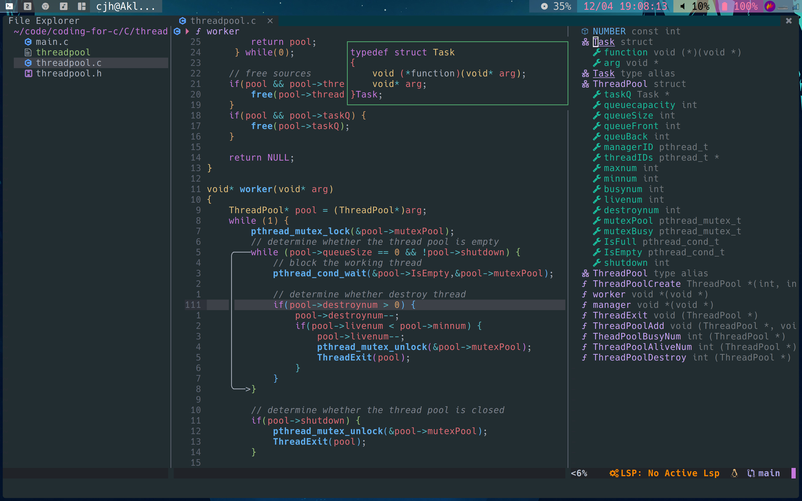

# WELCOME!!!
<!-- vim-markdown-toc GFM -->

* [use](#use)
* [File tree](#file-tree)

<!-- vim-markdown-toc -->

## use

**I using the archlinux so i can directly download language severs by pacman and other package manager,if you can't,use the mason plugin to install them and let them work**
1. Make usre you have installed te neovim(just to find corresponding distribution's way) and install other dependencies of other packages(pip,nodejs,yarn and others)

- Python3 install `pynvim`
- Nodejs install `neovim`
- Install Nerd font(I use hack)
- Install yarn

**use the next commmand in neovim to check the neovim isn't work normally** 
```plaintext
:Checkhealth
```
2. **Clone the repository:**
```plaintext
cd ~/.config
git clone https://github.com/aklk1ng/nvim.git
```
3. Start your neovim and if'will start download all plugins automatically
4. Now waiting to download(**the internet may be the most problem**)
5. Ok,that's all.And welcome you change or replace my plugins or configuration.
***Last but not least, if you find something wrong,try to complite the packer.lua file.You may find the problem disappear(if this isn't useful, try to read the woring message or delete the packer_compiled file)***
```plaintext
:PackerCompile
```
6. If you find the text can't highlight like before,try to run the next command,it always appear when you update the nvim-treesitter plugin,so you should update the config also
```plaintext
:TSUpdateSync
```
## File tree

**This maybe isn't correct because i will change or update my plugins and config but the file tree is complex to change the format!**

```dir
.
├── 2022-11-30_16-17.png
├── colors                                  
│   └── markdown.css                        -- markdown format
├── init.lua                                -- the neovim's begin
├── lua
│   ├── G.lua
│   ├── mapping.lua                         -- keymaps
│   ├── pack
│   │   ├── completion                      -- completion plugins config
│   │   │   ├── cmp.lua
│   │   │   └── lspconfig.lua
│   │   ├── language                        -- language plugins config
│   │   │   ├── markdown.lua
│   │   │   └── treesitter.lua
│   │   ├── tools                           -- some useful tools plugins config
│   │   │   ├── dap.lua
│   │   │   ├── fzflua.lua
│   │   │   ├── nvim-dap-virtual-text.lua
│   │   │   ├── nvim-tree.lua
│   │   │   ├── vim-dadbod.lua
│   │   │   └── vim-visual-multi.lua
│   │   └── ui                              -- some beautiful ui plugins config
│   │       ├── alpha.lua
│   │       ├── bufferline.lua
│   │       ├── colorizer.lua
│   │       ├── lspsaga.lua
│   │       └── lualine.lua
│   ├── package.json                        -- my snippets config
│   ├── packer-init.lua                     -- plugins list
│   ├── profile.lua                         -- all the neovim's options
│   └── snippets                            -- all my snippets
├── plugin
│   └── packer_compiled.lua
└── README.md
```
