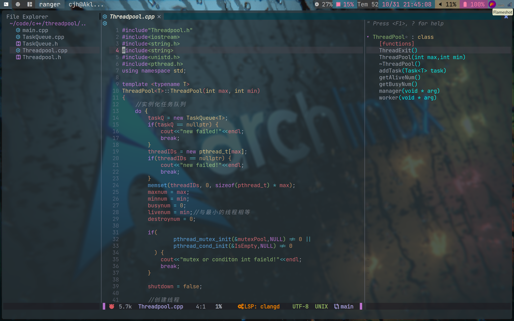

<!-- vim-markdown-toc GFM -->

* [use](#use)
* [File tree(this maybe isn't correct beacause the file tree is complex to change the format)](#file-treethis-maybe-isnt-correct-beacause-the-file-tree-is-complex-to-change-the-format)

<!-- vim-markdown-toc -->

## use
1. Make usre you have installed te neovim(just to find corresponding distribution's way)
2. Clone the repository:
```plaintext
cd ~/.config
git clone https://github.com/aklk1ng/nvim.git
```
3. Start your neovim and if'will start download all plugins automatically
4. Now waiting to download
5. Ok,that's all.And welcome you change or replace my plugins or configuration.
***Last but not least, if you find something wrong,try to complite the packer.lua file.You may find the problem disappear.***
```plaintext
:PackerCompile
```
## File tree(this maybe isn't correct beacause the file tree is complex to change the format)

***This maybe isn't correct beacause the file tree is complex to change the format!***

```dir
├── colors                          --some color theme and makrdown format
│   ├── markdown.css
│   ├── onedark.vim
│   └── solarized8_high.vim
├── init.lua                        --like the main function in cpp/c to load my config files
├── lua
│   ├── G.lua                       --my options prefix configuration
│   ├── macos.lua                   --a file for macos config(maybe i will use it in the furture)
│   ├── mapping.lua                 --my major mappings in my neovim,others are in the corresponding plugin file in the pack folder
│   ├── pack                        --all my plugin config
│   │   ├── alpha.lua
│   │   ├── alternate-toggle.lua
│   │   ├── autopairs.lua
│   │   ├── bufferline.lua
│   │   ├── cmp.lua
│   │   ├── coc.lua
│   │   ├── colorizer.lua
│   │   ├── dap.lua
│   │   ├── git.lua
│   │   ├── gitsigns.lua
│   │   ├── lsp
│   │   │   ├── c.lua
│   │   │   ├── lua.lua
│   │   │   ├── python.lua
│   │   │   └── setup.lua
│   │   ├── lspkind.lua
│   │   ├── lspsaga.lua
│   │   ├── lualine.lua
│   │   ├── markdown.lua
│   │   ├── neosolarized.lua
│   │   ├── null-ls.lua
│   │   ├── nvim-cmp.lua
│   │   ├── nvim-tree.lua
│   │   ├── telescope.lua
│   │   ├── treesitter.lua
│   │   └── vim-visual-multi.lua
│   ├── packer-init.lua             --the plugin manager and i list all my plugin in this file
│   ├── profile.lua                 --my neovim options major configuration
│   ├── snippets                    --now it is empty(although i think the snippets are not comfortable for me,but i can change a another way to use it)
│   └── windows.lua                 --a file for windows config(though i haven't use)
├── plugin
│   └── packer_compiled.lua         --the packer's complite file,i ignore it because it's unique to each user and chang frequently if you use the update command frequently
└── README.md
```
