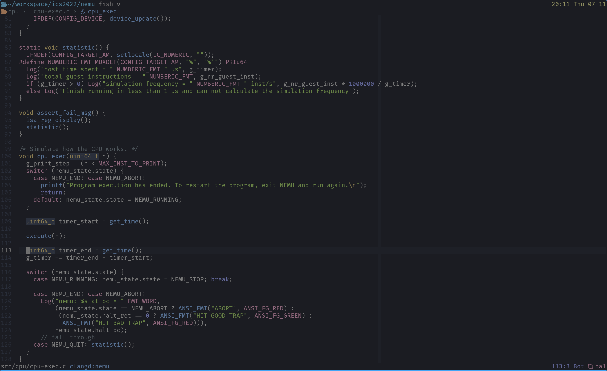

<p align="center">
  
</p>

## Version

`prerelease` 😉

## Use

1.Install some dependencies(**pip**,**nodejs**,**yarn**)

- Python3 install `pynvim`

```plaintext
pip3 install pynvim
```

- Nodejs install `neovim`

```plaintext
npm install -g neovim
```

- Install Nerd font(i use **JetBrainsMono Nerd Font**)

  [nerd font](https://www.nerdfonts.com/font-downloads)

- Install `yarn`

2. Clone the repository:

```plaintext
cd ~/.config
git clone https://github.com/aklk1ng/nvim.git
```

3. Start your neovim and it will start download all plugins automatically ~~if the network is normal~~

## Thanks

- [glepnir](https://github.com/glepnir/nvim)
